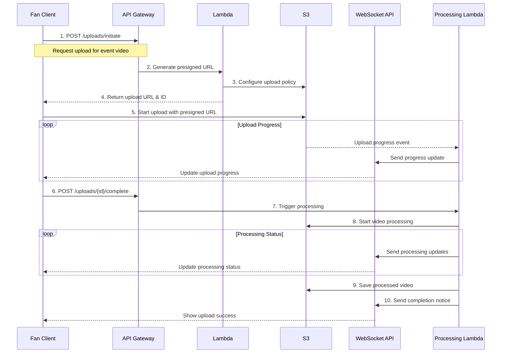
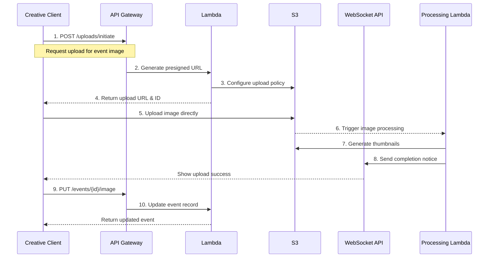

# DropClip API and Database Access Patterns

## Current Architecture Analysis

### 1. Direct Database Access

Currently, the application uses a mix of direct DynamoDB access and API Gateway patterns:

#### Direct DynamoDB Access (Current)

- Event management (`src/services/content.service.ts`)
- Upload management (`src/services/operations/upload.operations.ts`)
- Playlist operations (`src/services/playlist.service.ts`)
- Collection management (`src/services/collection.service.ts`)
- Moderation operations (`src/services/moderation.service.ts`)

#### API Gateway Access (Current)

- Fan events retrieval (`src/lambda/events/getFanEvents.ts`)
- Creative events management (`src/lambda/events/getCreativeEvents.ts`)
- Presigned URL generation (`src/lambda/s3/generatePresignedUrl.ts`)

### 2. Identified Issues

#### Security Concerns

1. **Overly Permissive IAM Roles:**

   - Direct DynamoDB access in client-side code
   - Broad permissions in IAM roles
   - Limited audit capability
   - Potential security vulnerabilities

2. **Inconsistent Access Patterns:**

   - Mixed use of direct access and API Gateway
   - Inconsistent error handling
   - Varied authentication approaches
   - Difficult to maintain security standards

3. **Performance and Scalability:**
   - No consistent caching strategy
   - Potential for excessive database calls
   - Limited ability to optimize queries
   - No request batching

## Recommended Architecture

### 1. API-First Approach

#### API Gateway Layer

All data operations should go through API Gateway EXCEPT:

- Real-time notifications (WebSocket API)
- Upload progress updates (WebSocket API)
- Processing status updates (WebSocket API)

#### Understanding Uploads vs Content

The system separates media handling into two distinct concerns:

1. **Uploads**: Handles the process of file transfer

   - Upload initiation
   - Presigned URL generation
   - Upload status tracking
   - File processing
   - Progress monitoring

2. **Content**: Manages the organization and access of uploaded media
   - Content categorization
   - Metadata management
   - Access control
   - Content moderation
   - Organization (playlists, collections)

#### Lambda Functions Organization

```
/lambda
  /uploads
    - initiateUpload.ts        # Generate presigned URL
    - completeUpload.ts        # Process uploaded file
    - getUploadStatus.ts       # Check upload progress
    - processUpload.ts         # Handle post-upload processing
  /content
    - getVideos.ts            # Get video content
    - getImages.ts            # Get image content
    - updateContent.ts        # Update content metadata
    - moderateContent.ts      # Handle content moderation
  /events
    - getEvents.ts
    - createEvent.ts
    - updateEvent.ts
    - deleteEvent.ts
  /users
    - getProfile.ts
    - updateProfile.ts
  /notifications
    - getNotifications.ts
    - markAsRead.ts
```

### 2. Access Patterns

#### Upload Operations

```typescript
interface UploadEndpoints {
  // Initiate Upload
  "POST /uploads/initiate": {
    body: {
      type: "video" | "image";
      purpose: "event" | "profile" | "fan-submission";
      eventId?: string;
      metadata?: {
        filename: string;
        fileSize: number;
        mimeType: string;
      };
    };
    response: {
      uploadUrl: string;
      uploadId: string;
      expiresIn: number;
    };
  };

  // Complete Upload
  "POST /uploads/{uploadId}/complete": {
    body: {
      status: "success" | "failed";
      metadata?: {
        duration?: number;
        dimensions?: {
          width: number;
          height: number;
        };
        fileSize: number;
      };
    };
    response: {
      contentId: string;
      status: "processing" | "failed";
    };
  };

  // Check Upload Status
  "GET /uploads/{uploadId}/status": {
    response: {
      status: "pending" | "uploading" | "processing" | "completed" | "failed";
      progress?: number;
      error?: string;
    };
  };
}
```

#### Content Operations

```typescript
interface ContentEndpoints {
  // Get Videos
  "GET /content/videos": {
    query: {
      type: "fan-submissions" | "own-uploads";
      eventId?: string;
      status?: "pending" | "approved" | "rejected";
      page?: number;
      limit?: number;
    };
    response: {
      videos: Video[];
      total: number;
      hasMore: boolean;
    };
  };

  // Get Images
  "GET /content/images": {
    query: {
      purpose: "profile" | "event" | "fan-submission";
      eventId?: string;
      status?: "pending" | "approved" | "rejected";
      page?: number;
      limit?: number;
    };
    response: {
      images: Image[];
      total: number;
      hasMore: boolean;
    };
  };

  // Update Content Status
  "PUT /content/{contentId}/status": {
    body: {
      status: "approved" | "rejected";
      moderationNotes?: string;
    };
    response: {
      content: Content;
      notificationSent: boolean;
    };
  };
}
```

### 3. Upload Flow Diagrams

#### Fan Video Upload Flow



#### Creative Event Image Upload Flow



### 4. WebSocket Integration

WebSocket API is crucial for real-time updates and is used for:

1. **Upload Progress Updates**

   - Real-time upload progress
   - Processing status updates
   - Error notifications
   - Completion notifications

2. **Content Status Updates**
   - Moderation status changes
   - Processing completion
   - Fan notifications
   - Content availability

#### WebSocket Message Types

```typescript
interface WebSocketMessages {
  // Upload Progress
  UploadProgress: {
    uploadId: string;
    progress: number;
    status: "uploading" | "processing" | "completed" | "failed";
    error?: string;
  };

  // Content Updates
  ContentUpdate: {
    contentId: string;
    status: "approved" | "rejected" | "processing";
    message?: string;
  };

  // System Notifications
  Notification: {
    type: "upload" | "moderation" | "system";
    message: string;
    data?: any;
  };
}
```

## Implementation Roadmap

### Phase 1: API Gateway Migration

1. Create new API Gateway endpoints
2. Implement Lambda functions
3. Update IAM roles
4. Add proper validation

### Phase 2: Client Updates

1. Update service layer
2. Implement error handling
3. Add retry logic
4. Update types

### Phase 3: WebSocket Integration

1. Set up WebSocket API
2. Migrate notifications
3. Add real-time updates
4. Implement reconnection logic

## Security Considerations

### 1. IAM Roles Update

```json
{
  "Version": "2012-10-17",
  "Statement": [
    {
      "Effect": "Allow",
      "Action": ["execute-api:Invoke"],
      "Resource": [
        "arn:aws:execute-api:${region}:${account}:${apiId}/${stage}/${method}/${resource}"
      ]
    }
  ]
}
```

### 2. API Gateway Authorization

- Cognito User Pools for authentication
- IAM roles for service-to-service
- API keys for external services
- Resource policies for IP restrictions

## Monitoring and Logging

### 1. CloudWatch Integration

- API Gateway access logs
- Lambda execution logs
- Custom metrics for operations
- Alarm configuration

### 2. Performance Monitoring

- API latency tracking
- Error rate monitoring
- Resource utilization
- Cost analysis

## Success Metrics

### 1. Performance Metrics

- API response times < 200ms
- WebSocket latency < 100ms
- Error rates < 0.1%
- Cache hit ratio > 80%

### 2. Security Metrics

- Failed authentication attempts
- Resource access violations
- Rate limit breaches
- Security scan results

## Migration Strategy

### Step 1: Preparation

1. Document all current access patterns
2. Create new API endpoints
3. Set up monitoring
4. Update documentation

### Step 2: Implementation

1. Deploy new API endpoints
2. Update client services
3. Migrate existing features
4. Add logging and monitoring

### Step 3: Validation

1. Test all scenarios
2. Monitor performance
3. Validate security
4. Gather metrics

## Conclusion

This architecture provides:

1. Consistent security model
2. Scalable infrastructure
3. Maintainable codebase
4. Clear access patterns
5. Real-time capabilities
6. Proper monitoring

The migration should be done incrementally, with careful testing at each stage to ensure no disruption to existing functionality.
