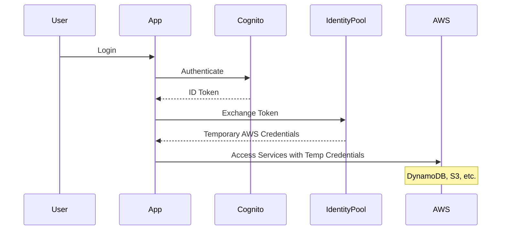

# DropClip Identity Pool Implementation Plan

## Overview

This document outlines the plan to implement AWS Cognito Identity Pool as the primary authentication and authorization mechanism for all AWS service access in the DropClip application. This change is essential for security, scalability, and proper access control.

## Current Issues

1. **Security Vulnerabilities**

   - Hardcoded AWS credentials in `.env` file
   - Long-lived access keys in client-side code
   - Potential for credential exposure

2. **Inconsistent Access Patterns**

   - Mixed use of direct AWS credentials and Cognito tokens
   - Inconsistent permission boundaries
   - Lack of proper audit trail

3. **Scalability Limitations**
   - Manual credential management
   - Limited user-specific permissions
   - Complex security maintenance

## Architecture Diagram



## Implementation Plan

### Phase 1: Identity Pool Setup

1. **Create Identity Pool**

```bash
aws cognito-identity create-identity-pool \
  --identity-pool-name "DropClipIdentityPool" \
  --allow-unauthenticated-identities false \
  --cognito-identity-providers ProviderName="cognito-idp.${region}.amazonaws.com/${userPoolId}",ClientId="${clientId}",ServerSideTokenCheck=true
```

2. **Configure IAM Roles**

```json
{
  "Version": "2012-10-17",
  "Statement": [
    {
      "Effect": "Allow",
      "Principal": {
        "Federated": "cognito-identity.amazonaws.com"
      },
      "Action": "sts:AssumeRoleWithWebIdentity",
      "Condition": {
        "StringEquals": {
          "cognito-identity.amazonaws.com:aud": "${identityPoolId}"
        }
      }
    }
  ]
}
```

### Phase 2: Role-Based Access Control

1. **Fan Role Permissions**

```json
{
  "Version": "2012-10-17",
  "Statement": [
    {
      "Effect": "Allow",
      "Action": ["dynamodb:Query", "dynamodb:GetItem"],
      "Resource": [
        "arn:aws:dynamodb:*:*:table/dev-notifications",
        "arn:aws:dynamodb:*:*:table/dev-events"
      ],
      "Condition": {
        "ForAllValues:StringEquals": {
          "dynamodb:LeadingKeys": ["${cognito-identity.amazonaws.com:sub}"]
        }
      }
    },
    {
      "Effect": "Allow",
      "Action": ["s3:PutObject"],
      "Resource": [
        "arn:aws:s3:::${uploadBucket}/${cognito-identity.amazonaws.com:sub}/*"
      ]
    }
  ]
}
```

2. **Creative Role Permissions**

```json
{
  "Version": "2012-10-17",
  "Statement": [
    {
      "Effect": "Allow",
      "Action": [
        "dynamodb:Query",
        "dynamodb:GetItem",
        "dynamodb:PutItem",
        "dynamodb:UpdateItem"
      ],
      "Resource": ["arn:aws:dynamodb:*:*:table/dev-*"],
      "Condition": {
        "ForAllValues:StringEquals": {
          "dynamodb:LeadingKeys": ["${cognito-identity.amazonaws.com:sub}"]
        }
      }
    },
    {
      "Effect": "Allow",
      "Action": ["s3:PutObject", "s3:GetObject", "s3:ListBucket"],
      "Resource": [
        "arn:aws:s3:::${contentBucket}/${cognito-identity.amazonaws.com:sub}/*",
        "arn:aws:s3:::${uploadBucket}/*/to-creative/${cognito-identity.amazonaws.com:sub}/*"
      ]
    }
  ]
}
```

### Phase 3: Client Implementation

1. **AWS Client Configuration**

```typescript
// aws-client.config.ts
import { fromCognitoIdentityPool } from "@aws-sdk/credential-provider-cognito-identity";
import { CognitoIdentityClient } from "@aws-sdk/client-cognito-identity";

const createAWSCredentials = async () => {
  const { tokens } = await fetchAuthSession();
  const idToken = tokens?.idToken?.toString();

  if (!idToken) {
    throw new Error("No authentication token found");
  }

  return fromCognitoIdentityPool({
    client: new CognitoIdentityClient({ region }),
    identityPoolId,
    logins: {
      [`cognito-idp.${region}.amazonaws.com/${userPoolId}`]: idToken,
    },
  });
};

export const createAWSClient = async (ClientClass: any) => {
  const credentials = await createAWSCredentials();
  return new ClientClass({ region, credentials });
};
```

2. **Service Client Updates**

```typescript
// Example: notification.service.ts
export const notificationService = {
  async getClient() {
    return createAWSClient(DynamoDBClient);
  },

  async getNotifications(userId: string) {
    const client = await this.getClient();
    // Use client with temporary credentials
  },
};
```

### Phase 4: Security Enhancements

1. **Environment Cleanup**

```diff
# .env
- AWS_ACCESS_KEY_ID=XXXXXXXXXXXXXXXXXXXX
- AWS_SECRET_ACCESS_KEY=XXXXXXXXXXXXXXXXXXXXXXXXXXXXXXXXXXXXXXXX
+ # AWS Cognito Configuration
+ VITE_USER_POOL_ID=eu-north-1_XXXXXXXX
+ VITE_USER_POOL_CLIENT_ID=XXXXXXXXXXXXXXXXXXXXXXXX
+ VITE_IDENTITY_POOL_ID=eu-north-1:XXXXXXXX-XXXX-XXXX-XXXX-XXXXXXXXXXXX
```

2. **Token Handling**

```typescript
// auth.service.ts
export const refreshCredentials = async () => {
  try {
    const session = await fetchAuthSession();
    if (!session.tokens?.idToken) {
      throw new Error("No valid session");
    }
    return session;
  } catch (error) {
    console.error("Failed to refresh credentials:", error);
    throw error;
  }
};
```

## Migration Steps

1. **Preparation**

   - Audit current AWS service usage
   - Document all access patterns
   - Create new Identity Pool
   - Configure IAM roles

2. **Implementation**

   - Update AWS client configuration
   - Remove hardcoded credentials
   - Update service clients
   - Implement credential refresh

3. **Testing**

   - Verify fan role access
   - Test creative role permissions
   - Check notification functionality
   - Validate upload process

4. **Deployment**
   - Deploy IAM role changes
   - Update environment variables
   - Monitor for issues
   - Enable logging

## Success Metrics

1. **Security**

   - No hardcoded credentials
   - Proper role assumption
   - Successful credential rotation
   - Audit trail availability

2. **Functionality**

   - Successful service access
   - Proper permission enforcement
   - Error-free operations
   - Correct user isolation

3. **Performance**
   - Minimal latency impact
   - Successful credential refresh
   - No service disruptions
   - Proper error handling

## Rollback Plan

1. **Immediate Rollback**

   - Restore previous AWS configuration
   - Revert service clients
   - Re-enable direct access
   - Monitor for issues

2. **Gradual Rollback**
   - Service-by-service reversion
   - Maintain dual access patterns
   - Monitor performance
   - Document issues

## Future Considerations

1. **Enhanced Security**

   - Implement MFA
   - Add IP-based restrictions
   - Enable enhanced monitoring
   - Implement alerting

2. **Scalability**

   - Cross-region support
   - Multi-account strategy
   - Performance optimization
   - Enhanced logging

3. **Maintenance**
   - Regular security reviews
   - Permission audits
   - Documentation updates
   - Training materials
