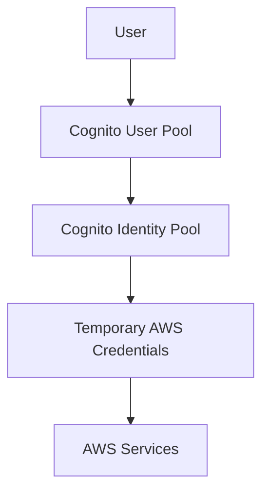

# DropClip AWS IAM Roles and Permissions Structure

## Overview

This document outlines the complete IAM roles and permissions structure for the DropClip application, following AWS best practices for security and scalability.

## Authentication Flow

### Cognito Identity Pools

- **User Pool**: Authentication provider for user sign-up/sign-in
- **Identity Pool**: Provides temporary AWS credentials based on user identity
- **Federation**: Allows for future social identity providers



## Role Structure

### 1. User-Based Roles (via Cognito)

#### Fan Role

```json
{
  "Version": "2012-10-17",
  "Statement": [
    {
      "Effect": "Allow",
      "Action": ["dynamodb:Query", "dynamodb:Scan", "dynamodb:GetItem"],
      "Resource": [
        "arn:aws:dynamodb:*:*:table/dev-events",
        "arn:aws:dynamodb:*:*:table/dev-follows",
        "arn:aws:dynamodb:*:*:table/dev-events/index/*"
      ],
      "Condition": {
        "ForAllValues:StringEquals": {
          "dynamodb:LeadingKeys": ["${cognito-identity.amazonaws.com:sub}"]
        }
      }
    },
    {
      "Effect": "Allow",
      "Action": ["s3:PutObject"],
      "Resource": [
        "arn:aws:s3:::dropclip-fan-uploads/${cognito-identity.amazonaws.com:sub}/*",
        "arn:aws:s3:::dropclip-fan-uploads/*/to-creative/*"
      ]
    }
  ]
}
```

#### Creative Role

```json
{
  "Version": "2012-10-17",
  "Statement": [
    {
      "Effect": "Allow",
      "Action": ["dynamodb:*"],
      "Resource": [
        "arn:aws:dynamodb:*:*:table/dev-events",
        "arn:aws:dynamodb:*:*:table/dev-follows"
      ],
      "Condition": {
        "ForAllValues:StringEquals": {
          "dynamodb:LeadingKeys": ["${cognito-identity.amazonaws.com:sub}"]
        }
      }
    },
    {
      "Effect": "Allow",
      "Action": ["s3:GetObject", "s3:ListObjects"],
      "Resource": [
        "arn:aws:s3:::dropclip-fan-uploads/*/to-creative/${cognito-identity.amazonaws.com:sub}/*",
        "arn:aws:s3:::dropclip-creative-content/${cognito-identity.amazonaws.com:sub}/*"
      ]
    }
  ]
}
```

### 2. Service Roles

#### Fan Events Lambda Role

```json
{
  "Version": "2012-10-17",
  "Statement": [
    {
      "Effect": "Allow",
      "Action": ["dynamodb:Query", "dynamodb:Scan", "dynamodb:GetItem"],
      "Resource": [
        "arn:aws:dynamodb:*:*:table/dev-events",
        "arn:aws:dynamodb:*:*:table/dev-follows",
        "arn:aws:dynamodb:*:*:table/dev-events/index/*"
      ]
    },
    {
      "Effect": "Allow",
      "Action": [
        "logs:CreateLogGroup",
        "logs:CreateLogStream",
        "logs:PutLogEvents"
      ],
      "Resource": "arn:aws:logs:*:*:*"
    }
  ]
}
```

#### Notification Service Role

```json
{
  "Version": "2012-10-17",
  "Statement": [
    {
      "Effect": "Allow",
      "Action": ["dynamodb:*"],
      "Resource": [
        "arn:aws:dynamodb:*:*:table/dev-notifications",
        "arn:aws:dynamodb:*:*:table/dev-notifications/index/*"
      ]
    },
    {
      "Effect": "Allow",
      "Action": ["ses:SendEmail", "ses:SendRawEmail"],
      "Resource": "*"
    }
  ]
}
```

#### Content Processing Role

```json
{
  "Version": "2012-10-17",
  "Statement": [
    {
      "Effect": "Allow",
      "Action": ["s3:GetObject", "s3:PutObject", "s3:DeleteObject"],
      "Resource": [
        "arn:aws:s3:::dropclip-fan-uploads/*",
        "arn:aws:s3:::dropclip-creative-content/*",
        "arn:aws:s3:::dropclip-processed-content/*"
      ]
    },
    {
      "Effect": "Allow",
      "Action": ["dynamodb:UpdateItem"],
      "Resource": ["arn:aws:dynamodb:*:*:table/dev-events"]
    }
  ]
}
```

#### Analytics Role

```json
{
  "Version": "2012-10-17",
  "Statement": [
    {
      "Effect": "Allow",
      "Action": ["dynamodb:Query", "dynamodb:Scan"],
      "Resource": ["arn:aws:dynamodb:*:*:table/dev-*"]
    },
    {
      "Effect": "Allow",
      "Action": ["s3:GetObject", "s3:PutObject"],
      "Resource": ["arn:aws:s3:::dropclip-analytics/*"]
    }
  ]
}
```

## Environment Separation

### Development

- Tables prefixed with `dev-`
- Broader permissions for testing
- Debug logging enabled
- All roles have CloudWatch Logs access

### Staging

- Tables prefixed with `staging-`
- Production-like permissions
- Limited debug logging
- Sanitized data

### Production

- Tables prefixed with `prod-`
- Strict least-privilege access
- Minimal logging (errors only)
- No direct table access

## Security Best Practices

1. **Resource Naming**

   - Use consistent prefixes for all resources
   - Include environment in resource names
   - Use descriptive suffixes

2. **Access Patterns**

   - Use IAM conditions to scope access
   - Implement row-level security using user IDs
   - Use GSIs for access pattern optimization

3. **Monitoring and Auditing**

   - Enable CloudTrail for API activity
   - Use CloudWatch Logs for Lambda functions
   - Set up alerts for suspicious activity

4. **Key Management**
   - Use KMS for sensitive data encryption
   - Rotate keys regularly
   - Separate keys for different environments

## Additional Roles (Future Scale)

1. **Search Service Role**

   - ElasticSearch/OpenSearch access
   - Read-only event data access

2. **Payment Processing Role**

   - Stripe API integration
   - Transaction table access
   - Audit log access

3. **Content Delivery Role**

   - CloudFront distribution management
   - CDN cache management
   - Access logs processing

4. **Backup Role**
   - Cross-region replication
   - Backup table access
   - S3 lifecycle management

## Implementation Steps

1. **Initial Setup**

   ```bash
   # Create Cognito User Pool
   aws cognito-idp create-user-pool --pool-name dropclip-users

   # Create Identity Pool
   aws cognito-identity create-identity-pool \
     --identity-pool-name dropclip-identity \
     --allow-unauthenticated-identities false

   # Create base roles
   aws iam create-role --role-name dropclip-fan-role
   aws iam create-role --role-name dropclip-creative-role
   ```

2. **Role Association**

   ```bash
   # Associate roles with Identity Pool
   aws cognito-identity set-identity-pool-roles \
     --identity-pool-id "YOUR_IDENTITY_POOL_ID" \
     --roles authenticated="YOUR_AUTH_ROLE_ARN"
   ```

3. **Policy Attachment**
   ```bash
   # Attach policies to roles
   aws iam put-role-policy \
     --role-name dropclip-fan-role \
     --policy-name fan-base-policy \
     --policy-document file://policies/fan-policy.json
   ```

## Maintenance and Updates

1. **Regular Reviews**

   - Audit permissions monthly
   - Review CloudTrail logs
   - Update documentation

2. **Scaling Considerations**

   - Monitor IAM limits
   - Plan for cross-region expansion
   - Consider multi-account strategy

3. **Emergency Procedures**
   - Role revocation process
   - Credential rotation
   - Incident response

## References

- [AWS IAM Best Practices](https://docs.aws.amazon.com/IAM/latest/UserGuide/best-practices.html)
- [Cognito Developer Guide](https://docs.aws.amazon.com/cognito/latest/developerguide/what-is-amazon-cognito.html)
- [DynamoDB Security](https://docs.aws.amazon.com/amazondynamodb/latest/developerguide/security.html)

Let me explain the benefits of using Cognito Identity Pools and the new structure:

1. Cognito Identity Pools Benefits:
   Temporary Credentials: Instead of storing permanent AWS credentials in your frontend code (which is insecure), Cognito provides temporary, limited-scope credentials
   Fine-grained Access Control: Different user types (fans vs creatives) automatically get different AWS permissions
   Scalability: Can handle millions of users without managing individual IAM users
   Security: Credentials are automatically rotated and expire after a short time
   Identity Federation: Easy to add social logins (Google, Facebook, etc.) later
2. Role-Based Structure Benefits:
   a) Fan Role:
   // A fan can only: - Read events (for followed creatives) - Upload content to their own folder - View their own follows
   This means if a fan tries to modify another user's data, it's blocked at the AWS level, not just the application level.
   b) Creative Role:
   // A creative can: - Manage their own events - Access their own content - View their followers
   Creatives get more permissions but only for their own resources, enforced by the ${cognito-identity.amazonaws.com:sub} condition.
3. Service Roles Benefits:
   a) Fan Events Lambda:
   // This service can: - Read events and follows tables - Cannot modify data
   Perfect for the fan dashboard - can aggregate data but can't accidentally modify it.
   b) Notification Service:
   // This service can: - Manage notifications - Send emails
   Isolated from other services - if compromised, can't affect event data.
   c) Content Processing:
   // This service can: - Process uploaded content - Update event metadata
   Limited to exactly what it needs for video/image processing.
4. Environment Separation Benefits:
   dev-_ tables // More permissive, easier debugging
   staging-_ tables // Production-like but with test data
   prod-\* tables // Strict permissions, real user data
   This prevents development work from ever affecting production data.
5. Practical Example:
   // When a fan uploads content: 1. Fan authenticates with Cognito 2. Gets temporary credentials 3. Can only upload to: dropclip-fan-uploads/${their-user-id}/\* 4. Content processor has permission to move/process that content 5. Fan can't modify other users' uploads
6. Security Benefits:
   Zero Long-term Credentials: No AWS keys in your code
   Audit Trail: Every action is tied to a specific user
   Least Privilege: Each role has minimum needed permissions
   Resource Isolation: Users can't access each other's data
7. Scalability Benefits:
   Multi-Region Ready: Easy to replicate this structure
   Multi-Account Ready: Can separate prod/dev completely
   Cost Control: Easy to track usage per user/feature
   Performance: Direct AWS service access from client
8. Development Benefits:
   Clear Boundaries: Each service has clear permissions
   Easy Testing: Can use different roles for testing
   Simple Debugging: CloudWatch logs per service
   Easy Updates: Can modify permissions without code changes

Would you like me to explain any specific part in more detail or show how to implement a specific feature with this structure?

Perfect! The role mapping is now working correctly. Let's summarize what we've set up:
Fan User:
Email: testfan@example.com
User Type: fan
Gets assigned the dropclip-fan-role
Has access to read events and follow creatives
Creative User:
Email: testcreative@example.com
User Type: creative
Gets assigned the dropclip-creative-role
Has full access to manage their own events and content
Role Mapping Configuration:
Default authenticated role: dropclip-creative-role
Rule: If custom:userType equals "fan", assign dropclip-fan-role
Ambiguous cases fall back to the default authenticated role (creative)
Both users can now successfully obtain temporary AWS credentials with their respective IAM roles. The fan role has read-only access to events and follows, while the creative role has full access to manage their own events and content.

## Implementation Progress and Roadmap

### Current Status (7th January 2025)

#### ✅ COMPLETED:

1. Basic Cognito Setup:

   - User Pool with custom attributes
   - Identity Pool with role mapping
   - Authentication flow

2. User-Based Roles:

   - Fan Role with basic DynamoDB access and fan-to-creative upload permissions
   - Creative Role with event management and fan upload access permissions

3. Service Roles:
   - Fan Events Lambda Role for the events API

#### 🚧 IN PROGRESS:

1. Environment Separation:
   - Currently using `dev-` prefix for tables
   - Need to formalize staging and production setups

#### ❌ PENDING:

1. Additional Service Roles:

   - Notification Service Role
   - Content Processing Role
   - Analytics Role

2. Security Enhancements:

   - CloudTrail setup for API activity
   - CloudWatch Logs configuration
   - KMS setup for sensitive data

3. Future Scale Roles:
   - Search Service Role
   - Payment Processing Role
   - Content Delivery Role

### Implementation Plan

1. **Immediate Next Steps** (High Priority):

   - Implement Notification Service Role

     - Create IAM role with SES permissions
     - Set up DynamoDB notifications table
     - Configure CloudWatch logging

   - Set up Content Processing Role
     - Create S3 buckets for content storage
     - Configure DynamoDB event updates
     - Set up processing Lambda permissions

2. **Short Term** (Medium Priority):

   - Complete Environment Separation

     - Create staging environment
     - Set up production environment
     - Implement proper table prefixing

   - Implement Security Monitoring
     - Enable CloudTrail
     - Set up CloudWatch alerts
     - Configure audit logging

3. **Long Term** (Lower Priority):

   - Analytics Role Implementation

     - Set up analytics data store
     - Configure reporting permissions
     - Implement monitoring

   - Future Scale Roles
     - Search service setup
     - Payment processing integration
     - CDN configuration
